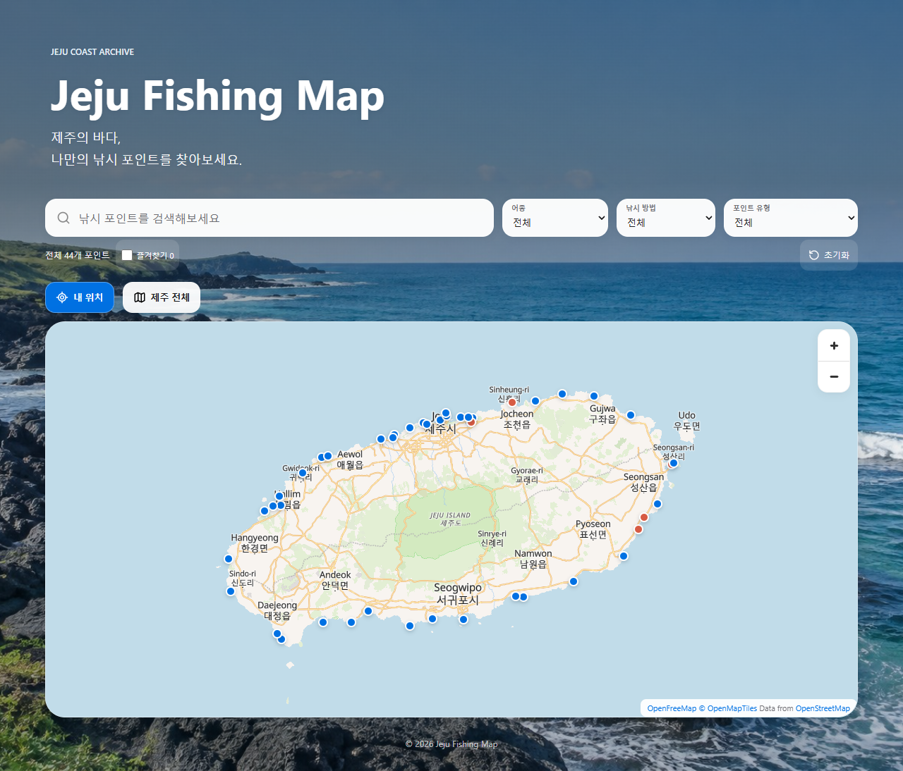
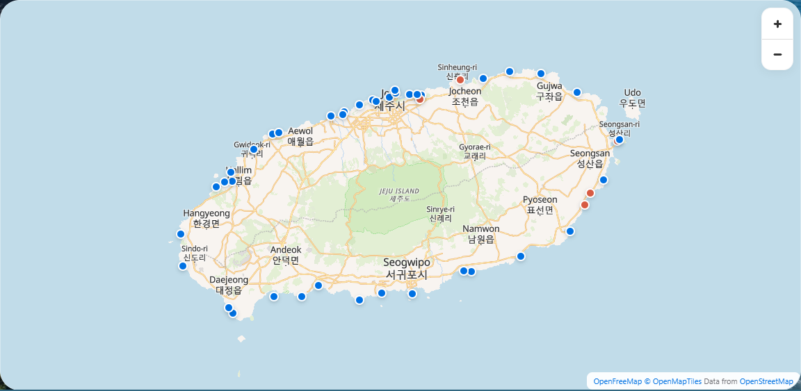
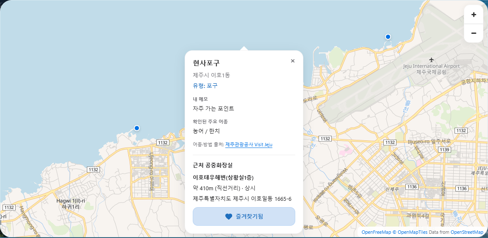
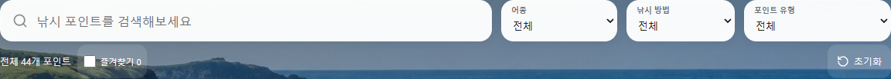
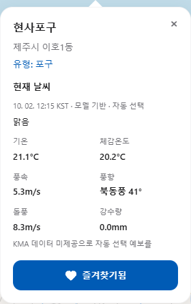
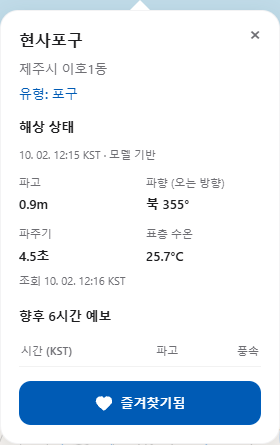
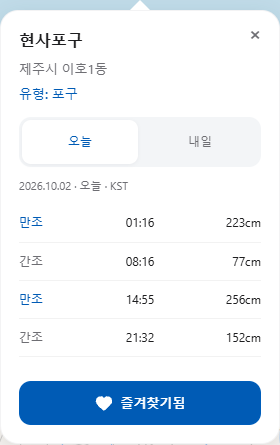

# 🎣 Jeju Fishing Map

**AI Vibe Coding을 활용한 제주도 낚시 포인트 지도 웹 애플리케이션**

제주 낚시 포인트를 지도에서 찾고 어종, 낚시 방법, 개인 메모, 주변 화장실을 함께 확인하는 웹앱입니다.
선택한 포인트의 날씨·해상 상태와 국립해양조사원의 공식 조석예보를 한 화면에서 조회할 수 있습니다.

[📄 PRD](./PRD.md) · [✅ TODO](./TODO.md) · [GitHub 저장소](https://github.com/gwichaneum/jeju-fishing-map) · [상세 구현·데이터 검증 기록](./docs/TECHNICAL_NOTES.md)

---

## 📌 프로젝트 소개

제주에서 낚시 장소를 찾을 때 포인트 위치, 어종, 날씨, 물때와 편의시설 정보가 서로 다른 곳에 있어 함께 확인하기 어려웠습니다.
개인적으로 저장해 둔 포인트와 메모도 지도에서 공개 자료와 함께 보고 싶어 이 프로젝트를 시작했습니다.

개인 목록을 정리하고 공개 낚시 자료를 보완해, 지도에서 장소를 선택하면 필요한 정보를 차례로 확인하도록 구성했습니다.
개발에는 Codex와 자연어로 요구사항을 주고받는 AI Vibe Coding 방식을 활용했습니다.
코드 초안은 AI의 도움을 받되 기능 범위, 데이터 확인, 화면 피드백과 최종 판단은 사용자가 담당했습니다.

### 현재 데이터 규모

| 항목 | 확인된 수치 |
| --- | ---: |
| 전체 포인트 기록 | 69개 |
| 개인 목록 기반 기록 / 추가 공개 포인트 | 54개 / 15개 |
| 좌표가 확인되어 지도에 표시되는 장소·기준점 | 44개 |
| 일반 파란 마커 / 개인·접근 기준점 코럴 마커 | 39개 / 5개 |
| 좌표 미확인으로 지도에서 제외한 기록 | 25개 |
| 저장된 화장실 자료 | 147개 |
| 제주시 자료 / 성산·남원 보조 자료 | 141개 / 6개 |

수치는 `fishing-spots.js`와 `restrooms.js`를 기준으로 확인했습니다.
개인 목록에서 온 항구도 일반 낚시 유형이면 파란 마커로 표시됩니다.
코럴 마커는 개인 기준점·접근 지점을 구분하며, 모든 개인 기록이 코럴색인 것은 아닙니다.

## 🎯 프로젝트 목표

- 제주 낚시 포인트를 지도에서 시각적으로 탐색한다.
- 개인적으로 수집한 장소와 공개 자료를 함께 정리한다.
- 어종·낚시 방법·메모를 출처와 구분해 제공한다.
- 검색과 필터로 원하는 포인트를 쉽게 찾는다.
- 주변 화장실과 현재 위치 기준 직선거리를 확인한다.
- 포인트별 날씨·해상 상태·공식 물때를 조회한다.
- PC와 모바일에서 사용할 수 있는 반응형 웹앱을 만든다.

## ✨ 주요 기능

### 🗺 제주 낚시 지도

- MapLibre GL JS + OpenFreeMap의 Liberty 스타일로 제주 지도를 표시합니다.
- 확대·축소·이동, 제주 전체 보기와 포인트 마커를 제공합니다.
- 좌표 미확인 기록은 검색에는 남기되 마커를 생성하지 않습니다.

### 📍 낚시 포인트 정보

- 팝업에 이름, 지역, 유형, 확인된 어종·낚시 방법과 개인 메모를 표시합니다.
- 개인 메모, 공개 자료와 사용자 제보 어종을 구분합니다.
- 출처와 위치 참고 문구를 표시하며, 긴 본문은 내부 스크롤로 확인합니다.
- 팝업 하단의 즐겨찾기 버튼은 본문 스크롤과 별도로 유지합니다.

### 🔎 검색 및 필터

- 이름·주소·지역·메모·별칭·어종·낚시 방법으로 검색합니다.
- 현재 데이터 기준 어종 30개, 낚시 방법 9개, 포인트 유형 3개를 제공합니다.
- 검색·어종·방법·유형·즐겨찾기 조건은 AND로 결합합니다.
- 초기화하면 전체 마커와 제주 전체 보기로 돌아가며 저장된 즐겨찾기는 지우지 않습니다.

### ❤️ 즐겨찾기

- 팝업에서 포인트를 추가·해제하고 지도 마커에 하트 배지를 표시합니다.
- 숫자 ID 목록을 LocalStorage에 저장해 새로고침·브라우저 재실행 후에도 유지합니다.
- 즐겨찾기 개수와 즐겨찾기만 보기 필터를 제공합니다.
- 저장소 오류가 발생하면 안내를 표시하고 현재 페이지에서는 임시 목록으로 계속 동작합니다.

### 📍 현재 위치와 가까운 포인트

- `내 위치` 버튼을 눌렀을 때만 브라우저 Geolocation을 요청합니다.
- 현재 위치·정확도와 조건에 맞는 가까운 포인트 최대 5곳을 표시합니다.
- Haversine 공식으로 직선거리를 계산해 목록·검색 결과·팝업에 표시합니다.
- 위치는 페이지 메모리에만 보관하며 별도로 서버나 LocalStorage에 저장하지 않습니다.

### 🚻 주변 화장실

- 정적 자료에서 직선거리 500m 이내의 가장 가까운 화장실을 찾습니다.
- 이름·거리·주소·개방시간·관리기관·정보 기준일·출처를 표시합니다.
- 현재 표시 포인트 44곳 중 22곳에 연결 가능한 자료가 있습니다.
- 자료가 없으면 `500m 이내 확인된 공중화장실 정보 없음`으로 안내합니다. 실제 화장실이 없다는 뜻은 아닙니다.

### ☀️ 날씨

- 포인트 팝업을 열면 Open-Meteo Forecast API를 요청합니다.
- 기온·체감온도·풍속·풍향·돌풍·강수량과 날씨 상태를 표시합니다.
- KMA 모델을 우선 요청하고 데이터 미제공 등의 경우 자동 선택 예보로 대체한 사실을 안내합니다.
- 시간은 한국 시간(KST), 풍속은 m/s로 표시합니다.

### 🌊 해상 상태

- Open-Meteo Marine API로 파고·파향·파주기·표층 수온을 표시합니다.
- 향후 +2·+4·+6시간의 파고·풍속을 간단한 표로 제공합니다.
- 날씨·해상 성공 응답은 10분 동안 메모리에 캐시합니다.
- 요청 실패와 누락값은 해당 영역에만 안내하며 다른 기능을 유지합니다.

### 🌙 공식 물때

- 해양수산부 국립해양조사원 조석예보(고, 저조) OpenAPI를 사용합니다.
- 제주·성산포·서귀포·모슬포 중 포인트와 가장 가까운 기준지점을 선택합니다.
- 오늘·내일 만조·간조 시각, 예측 조위(cm), 다음 물때와 남은 시간을 표시합니다.
- Node.js 프록시가 인증키를 보관하고 지점·날짜별 응답을 메모리에 캐시합니다.
- 공식 물때를 Open-Meteo 파고나 모델 해수면 값으로 대신 계산하지 않습니다.

## 🖼 프로젝트 화면

2026-10-02 실제 실행 화면입니다. 예보 수치·조회 시각·즐겨찾기 수는 캡처 당시 값입니다.
첨부 화면에 해당하는 구성을 현재 앱에서 다시 캡처하여 `assets/screenshots/`에 저장했습니다.

### 1. 메인 화면



### 2. 제주 낚시 지도



### 3. 포인트 Popup



### 4. 검색 및 필터



### 5. 날씨·해상 상태·공식 물때

| 현재 날씨 | 해상 상태 | 공식 물때 |
| --- | --- | --- |
|  |  |  |

## 🛠 기술 스택

| 영역 | 실제 사용 기술 | 역할 |
| --- | --- | --- |
| Frontend | HTML5, CSS3, JavaScript | 빌드 도구나 프레임워크 없이 화면·상태·상호작용 구현 |
| Map | MapLibre GL JS 6.11.2 | WebGL 지도, 마커, 팝업, 지도 이동 |
| Map Data | OpenFreeMap / OpenMapTiles / OpenStreetMap | Liberty 스타일과 지도 타일·기초 지리정보 |
| Backend | Node.js 22 이상, Express 5.2.1 | 정적 앱 파일 제공, 공식 물때 프록시 |
| Environment | dotenv 18.0.5 | 서버의 로컬 `.env` 설정 읽기 |
| Storage / Location | LocalStorage, Geolocation | 기기 내 즐겨찾기 저장, 사용자 허용 위치 조회 |
| Data / API | Open-Meteo Forecast·Marine, KHOA 조석예보 | 날씨·해상 모델 예보와 공식 조석예보 |
| Development | Codex, Git, GitHub | 자연어 기반 개발 보조와 버전·공개 이력 관리 |
| Test | Node.js test runner, 검증용 Playwright·PNG 검사 | 데이터·로직 자동 테스트와 브라우저·지도 화면 확인 |

MapLibre는 CDN에서 불러오며 npm 의존성은 Express와 dotenv 두 개입니다.
브라우저 검증 도구와 결과는 Git 제외 폴더 `.verify/`에 두었고 앱 실행 의존성에는 추가하지 않았습니다.

## 📂 프로젝트 구조

```text
jeju-fishing-map/
├── index.html                 # 메인 화면과 컨트롤
├── styles.css                 # 반응형 화면·팝업·날씨·물때 스타일
├── script.js                  # 지도·마커·팝업·화장실 연결
├── fishing-spots.js            # 개인·공개 포인트 및 출처
├── restrooms.js                # 화장실 자료 및 출처 메타데이터
├── spot-filters.js             # 검색·어종·방법·유형·즐겨찾기 필터
├── favorites.js                # LocalStorage 즐겨찾기 상태
├── location.js                 # 위치 요청·거리·가까운 목록
├── weather.js                  # Forecast·Marine 조회 및 화면 갱신
├── tide-utils.js               # 기준지점·한국 날짜·물때 시간 유틸리티
├── tides.js                    # 프론트엔드 물때 조회·오늘/내일 UI
├── server.js                   # Express 서버와 허용된 정적 파일 제공
├── serve.cjs                   # 기존 실행 명령 호환 진입점
├── server/
│   └── tide-service.cjs        # 공식 API 인증·검증·캐시·오류 처리
├── assets/
│   ├── jeju-coast.jpg          # 바다 배경
│   ├── *.svg                  # 검색·하트·위치 등 로컬 아이콘
│   ├── LUCIDE-LICENSE.txt      # 아이콘 라이선스
│   └── screenshots/           # README 실제 화면 7장
├── docs/
│   └── TECHNICAL_NOTES.md      # 기존 상세 구현·좌표·출처 기록
├── tests/
│   ├── *.test.cjs             # 데이터·필터·위치·API 등 테스트
│   └── fixtures/khoa-tides.json # 파서 테스트 전용 자료
├── package.json
├── package-lock.json
├── .env.example               # 실제 키 없는 설정 예시
├── .gitignore
├── PRD.md                     # 목적·범위·요구사항·인수 기준·검증 근거
├── TODO.md                    # 완료 작업·향후 개선 계획
└── README.md
```

로컬 `.env`, `node_modules/`, `.verify/`는 저장소에서 제외합니다.
`tests/fixtures/`의 물때 자료는 테스트용이며 실행 앱의 실제 예보로 사용하지 않습니다.

## 🚀 실행 방법

### 1. 저장소 Clone 및 폴더 이동

```bash
git clone https://github.com/gwichaneum/jeju-fishing-map.git
cd jeju-fishing-map
```

### 2. 패키지 설치

Node.js 22 이상과 npm이 필요합니다.

```bash
npm install
```

### 3. 환경변수 파일 준비

Windows PowerShell에서 아래 명령은 기존 `.env`가 없을 때만 예시 파일을 복사합니다.

```powershell
if (-not (Test-Path -LiteralPath .env)) {
    Copy-Item -LiteralPath .env.example -Destination .env
}
```

공식 물때를 사용하려면 공공데이터포털에서 승인된 인증키를 받아 로컬 `.env`의 예시 값을 교체합니다.

```dotenv
DATA_GO_KR_SERVICE_KEY=YOUR_SERVICE_KEY_HERE
```

위 값은 예시이며 실제 인증키가 아닙니다. 키가 없으면 공식 물때 영역만 오류를 안내하고 나머지 기능은 동작합니다.

### 4. 서버 실행

```bash
npm start
```

기본 주소는 **http://127.0.0.1:8080**입니다. `server.js`의 기본 host는 `127.0.0.1`, port는 `8080`입니다.
`npm run dev`는 Node watch 모드, `node serve.cjs`는 같은 서버의 호환 실행 명령입니다.

PowerShell에서 `npm.ps1` 실행 정책 오류가 나면 `npm.cmd install`, `npm.cmd start`, `npm.cmd test`를 사용합니다.
실행 정책을 바꿀 필요는 없습니다. 8080 포트가 사용 중이면 다른 포트로 실행할 수 있습니다.

```powershell
$env:PORT = "8081"
npm.cmd start
```

이 경우 http://127.0.0.1:8081 로 접속합니다.
물때 프록시 때문에 `file://`, Live Server, GitHub Pages만으로 모든 기능을 실행할 수는 없습니다.
지도·날씨 조회에는 인터넷이 필요하며, 실제 휴대폰의 위치 조회에는 HTTPS와 사용자 권한이 필요합니다.

## 🔐 API Key 설정

- [공공데이터포털 조석예보 OpenAPI](https://www.data.go.kr/data/15156018/openapi.do)에서 활용신청 후 승인된 ServiceKey를 준비합니다.
- 실제 키는 로컬 `.env`의 `DATA_GO_KR_SERVICE_KEY`에만 설정합니다. Decoding 값을 권장하며 Encoded 값도 서버에서 처리합니다.
- `.gitignore`는 `.env`, `.env.*`, `node_modules/`, `.verify/`를 제외하고 `.env.example`만 예외로 추적합니다.
- 브라우저는 같은 출처의 `/api/tides`에 기준지점과 날짜만 전달합니다. 서버가 인증키를 추가해 공식 API를 호출합니다.
- 키나 상위 API의 원본 오류·요청 URL은 브라우저에 반환하지 않습니다. 서버는 허용 목록의 앱 파일만 제공합니다.
- 키를 변경했다면 서버를 재시작합니다. 실제 키를 README·frontend·스크린샷·Git 커밋에 포함하면 안 됩니다.

Public 저장소의 `.env.example`에는 예시 값만 있습니다.
키가 실수로 공개됐다면 파일 삭제만으로 해결되지 않으므로 키 폐기·재발급과 Git 이력 점검이 필요합니다.

## 📡 데이터 및 API 출처

| 구분 | 실제 참고·사용 출처 | 사용 범위 |
| --- | --- | --- |
| 지도 표시 | [MapLibre](https://maplibre.org/), [OpenFreeMap](https://openfreemap.org/), [OpenStreetMap](https://www.openstreetmap.org/copyright) | 지도 라이브러리, 타일, 기초 지리정보 |
| 날씨 | [Open-Meteo Forecast](https://open-meteo.com/en/docs), [KMA 모델 문서](https://open-meteo.com/en/docs/kma-api) | 선택 포인트의 날씨 모델 예보 |
| 해상 | [Open-Meteo Marine](https://open-meteo.com/en/docs/marine-weather-api) | 파고·방향·주기·표층 수온 예보 |
| 공식 물때 | [공공데이터포털 KHOA 조석예보](https://www.data.go.kr/data/15156018/openapi.do), [KHOA 공식 조회 화면](https://khoa.go.kr/oceandata/openapi/odmi/odmiApiViewData.do?apiId=SV_AP_04_006) | 기준지점별 만조·간조 시각과 조위 |
| 화장실 | [제주시 공중화장실 자료](https://www.data.go.kr/data/15110521/fileData.do), [POOPOO 보조 자료](https://www.poopoo.co.kr) | 제주시 정적 기록과 성산·남원 주변 보조 기록 |
| 낚시 포인트 | 사용자가 제공한 개인 목록, [바다타임 제주](https://www.badatime.com/67/spots)·[모슬포](https://www.badatime.com/73/spots)·[신도](https://www.badatime.com/317/spots) | 개인 이름·메모, 공개 좌표·어종·방법 |
| 위치·주소 보완 | [제주관광공사 현사포구](https://www.visitjeju.net/kr/detail/view?contentsid=CNTS_000000000021167), [바다온 주소 기준점](https://badaon.or.kr/seantour_map/travel/destination/detail.do?destId=DEST023308), [서귀포시 주차장정보](https://www.data.go.kr/data/15012896/standard.do), OpenStreetMap·주소가·도로주소 | 명칭·대표 위치·주소 대조 |
| 어종 보완 | [피싱맵 제주항](https://fishingmap.co.kr/mobile/m_map_view.php?no=1020&wher=16), [낚시춘추 덕돌포구](https://m.fishingseasons.co.kr/news_Detail.asp?b_no=18992), [애월항 낚시 가이드](https://pigkim4.tistory.com/14) | 공개 어종·방법의 별도 출처 |

화장실 자료 기준일은 제주시 **2025-12-31**, 보조 자료 **2024-07-19**이며 개발 중 확인일은 **2026-10-01**입니다.
제주 전체 화장실을 수집한 것은 아니며 실행 중 크롤링하지 않습니다.
모델 예보와 공식 조석예보는 서로 다른 자료이고, 개인 메모·사용자 제보는 공개 자료의 검증 정보와 구분합니다.

장소별 상세 좌표·원문 링크·미확인 25곳의 보류 이유는 [상세 검증 기록](./docs/TECHNICAL_NOTES.md)과
[포인트 데이터](./fishing-spots.js), [화장실 데이터](./restrooms.js)에 보존했습니다.
무료 API의 이용 조건과 지도·데이터 라이선스는 실제 배포 전에 각 제공자의 최신 안내를 확인해야 합니다.

## 📋 PRD

PRD(Product Requirements Document)는 개발 전에 **무엇을, 누구를 위해, 어디까지 만들지** 정리하는 제품 요구사항 문서입니다.
프로젝트 목적, 대상 사용자, 핵심 기능, 개발 범위와 제외할 기능을 합의하는 기준이 됩니다.

이 프로젝트의 PRD는 최종 구현을 기준으로 다음 내용을 정리했습니다.

- 프로젝트 배경·목표, 대상 사용자와 사용 시나리오
- 구현 범위와 제외할 기능
- 지도부터 공식 물때까지 핵심 기능 9개(FR-01~FR-09)의 요구사항과 인수 기준
- 데이터 처리 원칙, 반응형·장애 격리·인증키 보안 등 비기능 요구사항
- 구현 파일·테스트 대응표, 과제 완료 기준과 향후 검증 확대 계획

2026-10-02 구현된 코드와 검증 결과를 바탕으로 완성한 요구사항 명세입니다.
기능별 요구사항·실제 동작·검증 결과를 비교하고 다음 단계의 개선 계획을 정하는 기준으로 활용할 수 있습니다.

[📄 PRD 보기](./PRD.md)

## ✅ TODO List

TODO List는 요구사항을 **구현하고 확인할 수 있는 작은 작업 단위**로 나눈 목록입니다.
PRD가 무엇을 만들지 정의한다면 TODO는 작업 진행 상황과 다음에 확인할 내용을 관리합니다.

현재 TODO에는 기본 화면·지도·포인트·검색/필터·즐겨찾기·현재 위치·날씨·물때와 최종 문서 작업이 정리되어 있습니다.
`Completed`에는 과제 범위의 완료 작업을, `Future Improvements`에는 향후 확장·검증 계획을 정리했습니다.
핵심 기능 구현과 자동·브라우저 검증을 완료했으며, 추가 좌표·화장실 보완과 실제 기기·현장 검증 확대는 향후 개선으로 분리했습니다.

[✅ TODO List 보기](./TODO.md)

## 🔄 개발 방법론

전체 앱을 한 번에 요청하기보다 기능을 작게 나누어 요구사항 전달·실행·검증·수정을 반복했습니다.
실제 Git 이력에서 확인되는 발전 순서는 **메인 화면 → 지도 → 포인트·팝업 → 검색/필터 → 즐겨찾기 → 현재 위치 → 날씨·해상 → 공식 물때**입니다.

```text
아이디어 선정
    ↓
요구사항·개발 범위 정리
    ↓
TODO 작성
    ↓
TODO 하나 선택 → Codex에 구체적인 요구사항 전달
    ↓
코드 초안 생성 → 직접 실행 및 테스트
    ↓
오류·데이터 확인 → 필요한 부분 수정
    ↓
Git Commit / Push → 다음 TODO
    ↓
최종 통합 점검 → PRD 명세·TODO 상태·README 보고서 정리
```

기능별 요구사항과 TODO로 구현을 진행하고, 최종 문서 정리 단계에서 PRD에 요구사항·인수 기준·검증 근거를 명시했습니다.
최종 점검에서는 새 기능을 추가하지 않고 기존 기능·데이터·보안 검증과 제출 문서 완성을 우선했습니다.

## 🆚 PRD / TODO 사용 전후 비교

아래 표는 별도의 비교 실험이나 시간 측정 결과가 아니라, 요구사항·작업 목록을 두는 개발 방식의 차이를 정리한 것입니다.

| 구분 | PRD/TODO 없이 개발할 경우 | PRD/TODO를 기준으로 개발할 경우 |
| --- | --- | --- |
| 개발 방향 | 생각나는 기능을 바로 추가하기 쉬움 | 목적과 범위를 먼저 확인 |
| AI 프롬프트 | 한 번에 많은 요구를 전달 | TODO별 입력·동작·제약을 구체적으로 전달 |
| 코드 수정 | 여러 기능이 함께 바뀔 가능성 | 변경 범위를 작게 유지하고 기존 동작 확인 |
| Git 관리 | 마지막에 변경을 한꺼번에 정리하기 쉬움 | 완료한 작업 단위로 Commit/Push 가능 |
| 문제 해결 | 어떤 변경이 오류를 만들었는지 찾기 어려움 | 어느 단계에서 문제가 생겼는지 추적하기 쉬움 |
| 범위 관리 | 기능이 계속 늘어나기 쉬움 | 제외할 기능과 향후 개선을 분리 |

처음부터 “제주 낚시 지도 앱을 만들어줘”라고 한 번에 요청할 수도 있었지만, TODO를 나누니 결과를 확인할 단위가 명확해졌습니다.
지도에서 물때까지 단계적으로 확장하면서 검색·즐겨찾기 등 기존 기능을 다시 점검할 수 있었습니다.
완성한 PRD는 이 경험을 요구사항별로 정리하고, 구현 파일·테스트·향후 개선 계획을 함께 추적할 수 있는 기준입니다.

## 🐙 Git & GitHub

기능별 커밋을 남겨 완성 결과뿐 아니라 개발 과정을 기록했습니다.
다음은 실제 로컬 Git 이력의 대표 커밋입니다. [Public 저장소](https://github.com/gwichaneum/jeju-fishing-map)에서 공개된 소스와 개발 이력을 확인할 수 있습니다.

```text
57395fc feat: create main page layout
dd0d46c feat: add working Jeju map with MapLibre
9b9f19a feat: add fishing spot markers and popups
e013599 feat: add fishing spot search and filters
fb6c977 feat: add fishing spot favorites
eba1126 feat: add current location and nearby spots
f04ac58 feat: add weather and marine conditions
d8b3d8c feat: add official tide forecast
7f43e9a fix: final testing and cleanup
a5fe715 docs: complete project README
```

커밋을 통해 기능 추가와 오류 수정의 경계를 확인할 수 있고, GitHub에서 소스와 변경 내역을 공개적으로 볼 수 있습니다.
작업 단위의 Commit 후 테스트 결과를 확인하고 Push하는 방식으로 관리할 수 있습니다.
Git log는 커밋 기록이므로 개별 Push의 시각·횟수까지 보여주는 자료는 아닙니다.
최종 PRD·README·TODO 보완 내용의 Commit/Push는 사용자가 문서를 확인한 뒤 직접 진행합니다.

## 🤖 Vibe Coding이란?

이 과제에서는 원하는 기능과 수정사항을 자연어로 AI에게 설명하고, 생성된 코드를 실행·확인·수정하는 방식으로 경험했습니다.
AI는 코드 초안과 문제 해결을 돕는 개발 보조 도구였으며 “AI가 전부 알아서 개발했다”는 의미는 아닙니다.

사용자는 요구사항과 기능 범위 결정, 결과 확인, 오류 판단, 데이터 검증, 디자인 피드백과 최종 의사결정을 맡았습니다.
예를 들어 미확인 좌표를 추정하지 말 것, 개인 메모와 공개 정보를 구분할 것, 최종 점검에서 기능을 늘리지 말 것을 명시했습니다.

## 👍 Vibe Coding의 장점

- 자연어 요구사항을 코드 초안으로 옮겨 화면에서 빠르게 확인할 수 있었습니다.
- 익숙하지 않은 지도·API·LocalStorage 연결을 시도하기 쉬웠습니다.
- 반복적인 UI·오류 처리 코드를 작성하고 테스트를 보완하는 데 도움을 받았습니다.
- 화면 피드백을 구체적인 수정 요구로 전달할 수 있었습니다.
- 오류 원인을 좁히고 작은 변경으로 다시 검증하는 작업을 지원받았습니다.

개발 시간을 정량 측정한 것은 아니므로 속도 개선을 특정 수치로 주장하지는 않습니다.

## 👎 Vibe Coding의 단점

- 요구사항이 모호하면 의도와 다른 화면이나 동작이 나올 수 있습니다.
- 한 번에 많은 기능을 요청하면 기존 코드에 미치는 영향이 커질 수 있습니다.
- 그럴듯한 좌표나 API 설명도 실제 자료와 다를 수 있어 별도 검증이 필요합니다.
- 코드가 실행되는 것과 작성된 내용을 이해하는 것은 다른 문제입니다.
- 기능을 계속 요청하면 과제 범위가 커지기 쉬워 종료 기준이 필요합니다.
- 최종적으로 사용자가 실제 화면·데이터·API·인증키 보안을 직접 확인해야 합니다.

이 프로젝트에서는 좌표가 불명확한 25곳을 임의로 채우지 않았고, 날씨 모델 대체 안내와 물때 인증키 설정을 명시했습니다.
이는 특정 AI의 문제가 아니라 자연어 기반 개발에서도 검증과 책임이 필요하다는 사례입니다.

## 💡 배운 점

- 전체 앱보다 작은 TODO 단위로 요청할 때 확인과 수정의 범위가 명확했습니다.
- 금지할 변경과 데이터 처리 기준까지 구체적으로 전달하는 것이 중요했습니다.
- AI가 만든 결과도 자동 테스트와 브라우저 확인을 함께 거쳐야 했습니다.
- 좌표·어종·화장실 자료는 출처와 확인 범위를 기록해야 했습니다.
- 작은 커밋은 이전 변경을 비교하고 개발 과정을 설명하는 데 도움이 됐습니다.
- Public GitHub에는 API Key를 공개하면 안 됩니다.
- 브라우저는 화면·탐색을, 서버는 인증이 필요한 공식 API 호출을 담당하는 역할 차이를 경험했습니다.

## 🧩 개발하면서 어려웠던 점

| 문제 | 실제 처리 방식 |
| --- | --- |
| 지도 표시와 반응형 화면 | 현재 MapLibre + OpenFreeMap으로 표시하고 PC·모바일·가로 전환 및 지도 픽셀을 검증 |
| 장소 이름만으로 좌표를 확정하기 어려움 | 주소·공개 자료를 대조하고 대표 위치와 실제 해안 발판을 구분, 불확실하면 마커 제외 |
| 개인 메모와 공개 어종의 혼동 | `userNote`, `species`, `reportedSpecies`와 출처를 분리 |
| 날씨와 물때의 서로 다른 데이터 구조 | `weather.js`와 `tides.js`를 분리하고 한국 시간·단위·누락값을 검증 |
| 공식 API 인증키와 공개 저장소 | Node.js 프록시와 `.env`로 키를 서버에만 보관 |
| 정보가 늘어난 모바일 팝업 | 내부 스크롤과 높이 계산, 고정된 즐겨찾기 버튼으로 접근성 유지 |

주소 수정·별도 출처·좌표 보류의 구체적인 근거는 [상세 검증 기록](./docs/TECHNICAL_NOTES.md)에 남겼습니다.

## 🔧 개선할 점

아래는 **현재 구현하지 않은 향후 후보**이며 이번 과제의 기능 범위에 포함하지 않았습니다.

- 좌표 미확인 25곳의 정확한 위치와 접근 기준점을 추가 확인하기
- 서귀포시 화장실 자료와 시설 개방시간을 보완하기
- 실제 휴대폰 GPS·네트워크 환경에서 검증을 확대하기
- 공공 자료의 변경 여부와 여러 출처의 일치 여부를 점검하는 절차 마련하기
- 기상특보와 해양경찰·현장 출입통제 정보의 연계 검토
- 포인트가 더 많아질 경우 마커 클러스터링 검토
- 출조 기록·사진·제보, 기기 간 즐겨찾기 동기화나 PWA 전환 검토

계정·데이터베이스·관리 기능이 필요한 확장은 별도 설계와 보안 검토가 필요하므로 이번 과제에서는 제외했습니다.

## ⚠️ 정보 이용 시 주의사항

- 날씨·해상 값은 모델 기반 참고 정보이며 실제 연안·방파제 상황과 다를 수 있습니다.
- 공식 조석예보도 기준지점의 예측값이지 포인트의 실시간 실측 조위가 아닙니다.
- 출조 전 공식 기상특보, 해양경찰·현장 통제와 실제 상황을 확인해야 합니다.
- 개인 메모의 “발판 좋음”, “안전함” 등은 과거 경험이며 현재 상태를 보장하지 않습니다.
- 테트라포드·갯바위 등에서는 현장 안전수칙을 준수해야 합니다.
- 대표 좌표가 확인되었다고 낚시 허용·출입 가능·현재 조황을 보장하지는 않습니다.
- 직선거리는 도보·이동 경로와 다릅니다. 화장실의 현재 개방 여부도 직접 확인해야 합니다.
- 포인트·시설 정보는 시간이 지나며 변할 수 있고, 좌표 미확인 기록은 검색에만 남습니다.
- LocalStorage 즐겨찾기는 브라우저·접속 주소별로 분리되며 사이트 데이터 삭제 시 사라질 수 있습니다.

## 🏁 결론

이번 프로젝트를 통해 AI가 단순히 코드를 대신 작성하는 것뿐 아니라, 아이디어를 화면으로 구현하고 반복적으로 개선하는 개발 보조 도구가 될 수 있음을 경험했습니다.
제주 낚시 포인트, 검색·필터, 즐겨찾기, 현재 위치·거리, 날씨·해상 상태와 공식 물때를 하나의 지도 중심 웹앱으로 연결했습니다.

중요했던 것은 AI의 결과를 그대로 믿는 대신 요구사항과 TODO로 범위를 정하고, 직접 화면을 확인하며 좌표·출처·API 오류와 인증키 보안을 검증하는 과정이었습니다.
불확실한 장소는 보류하고 개인 메모와 공개 정보를 구분했으며, 최종 PRD에는 요구사항·인수 기준·검증 근거를 정리했습니다.
과제 범위의 기능 구현과 자동·브라우저 검증을 완료하고, 실제 기기·현장 검증 확대는 향후 개선으로 정리했습니다.

기능별 커밋과 Public GitHub를 통해 프로젝트가 발전한 과정을 기록할 수 있었습니다.
이번 과제의 결과는 코드만 완성하는 경험을 넘어, **무엇을 만들지 결정하고 AI의 도움을 받아 구현한 뒤 사용자가 검증하고 책임지는 개발 방식**을 경험한 데 의미가 있습니다.
